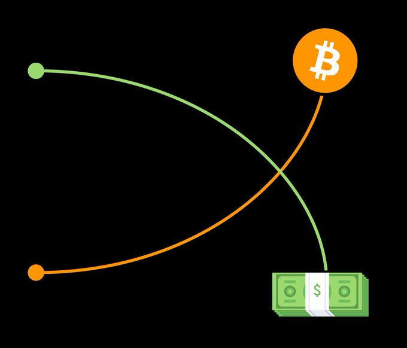

# Bitcoin as a Potential Alternative

Bitcoin presents a distinct alternative to the traditional fiat monetary system. It is a decentralized, scarce, and digitally native asset designed to function as a peer-to-peer electronic cash system.   

A defining characteristic of Bitcoin is its fixed supply of 21 million coins. This limit is hardcoded into the Bitcoin protocol and cannot be changed without a consensus among the majority of network participants. This fixed supply stands in stark contrast to fiat currencies, where central banks can increase the money supply at their discretion. This controlled supply is a key differentiator and has implications for Bitcoin's potential as a store of value.   

Several key properties distinguish Bitcoin from traditional assets and contribute to its potential as an alternative monetary system:

- **Scarcity**: As mentioned, Bitcoin's limited supply of 21 million coins creates inherent scarcity. This scarcity is a fundamental principle that distinguishes it from inflationary fiat currencies. The limited supply suggests that as demand for Bitcoin increases, its value could also increase, making it potentially resistant to the effects of inflation that erode the purchasing power of fiat currencies.
- **Decentralization**: Bitcoin operates on a decentralized network, meaning no single entity—such as a government, central bank, or corporation—controls it. This decentralization is achieved through a distributed ledger technology called blockchain, where a network of computers collectively validates and records transactions. This lack of central control makes Bitcoin resistant to censorship, manipulation, and single points of failure.
- **Portability**: Bitcoin is a digital asset that can be easily transferred across borders without the need for traditional financial intermediaries like banks. Transactions are conducted directly between users on the Bitcoin network, making international transfers faster and potentially less expensive. This portability makes it potentially useful for international trade and remittances.
- **Divisibility**: Each Bitcoin can be divided into smaller units called satoshis. One satoshi is equal to 0.00000001 Bitcoin. This high degree of divisibility makes Bitcoin suitable for transactions of any size, from small everyday purchases to large institutional transfers.

These properties—scarcity, decentralization, portability, and divisibility—form the basis of Bitcoin's potential as an alternative to the current monetary system and contribute to its consideration as a tool for long-term wealth accumulation.

